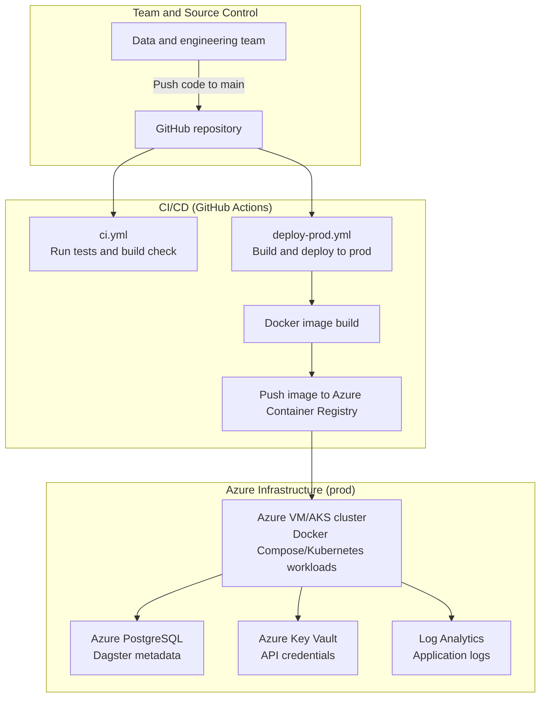

# Azure Deployment Plan (Simple: One `prod` Environment)

## Quick Deployment Flow

Current implementation target: **Azure VM**.  
Future reference: **AKS**.



## VM vs AKS: What Actually Changes

| Area | Azure VM | AKS |
|---|---|---|
| Deployment method | SSH to VM and run Docker Compose | Deploy with Kubernetes manifests or Helm |
| Core runtime objects | VM + Docker containers | Cluster + node pools + pods + services |
| Scaling approach | Mostly manual, usually vertical | Horizontal scaling with replicas and autoscaling |
| High availability | Limited on single VM unless extra setup | Better built-in multi-replica patterns |
| Secrets integration | Inject into VM/container runtime | Kubernetes Secrets or Key Vault CSI driver |
| Networking | VM ports, NSG rules, optional reverse proxy | Ingress controller, load balancer, service routing |
| Rollouts | Restart/update containers on VM | Rolling updates and rollout controls |
| Operations overhead | Lower to start, simpler for small teams | Higher complexity, better for larger scale |
| Cost profile | Usually cheaper at small scale | More overhead, pays off with scale/reliability needs |
| Best fit | Early stage, simple production setup | Mature platform team, larger workloads |

## 1) Goal

Start with the easiest stable setup for a data/business-focused team:
- One environment only: `prod`
- Minimal infrastructure
- Simple CI/CD
- Clear place for API credentials

You can add `dev/staging` later after the team is comfortable.

## 2) Minimal Azure Architecture (Current Plan)

Use these services for the current VM-based rollout:

1. `Azure VM` (Docker Compose)
- Run `dagster-webserver`, `dagster-daemon`, and `dagster-user-code`

2. `Azure Database for PostgreSQL`
- Dagster run/event/schedule metadata

3. `Azure Key Vault`
- Store API credentials and other secrets

4. `Azure Container Registry (ACR)`
- Store Docker images

5. `Log Analytics Workspace`
- Basic logs and monitoring

## 3) Where to Store API Credentials

Store secrets in **Azure Key Vault**.

Examples:
- `jsonplaceholder-api-token`
- `thirdparty-api-key`
- `slack-webhook-url`

Access pattern:
1. Enable **Managed Identity** for Dagster apps
2. Grant Key Vault secret read access (`get`, `list`)
3. Read secrets at runtime (environment variable reference or SDK)

Do not keep credentials in repo files, Dockerfile, or committed `.env`.

## 4) Suggested Folder Structure (Simple IaC)

```text
dagster_demo/
├── src/
├── Dockerfile
├── workspace.yaml
├── infra/
│   └── terraform/
│       └── prod/
│           ├── main.tf
│           ├── variables.tf
│           ├── outputs.tf
│           └── terraform.tfvars
└── .github/
    └── workflows/
        ├── ci.yml
        └── deploy-prod.yml
```

No modules initially. Keep everything in `infra/terraform/prod` until team maturity increases.

## 5) Simple CI/CD Flow (Current Plan)

### A) `ci.yml` (on Pull Request)

Trigger: PR to `main`

Steps:
1. Run tests (`make test`)
2. Build Docker image (sanity check)

### B) `deploy-prod.yml` (on merge to `main`)

Trigger: push to `main`

Steps:
1. Build image
2. Tag image with commit SHA
3. Push image to ACR
4. Deploy/update Docker Compose on Azure VM in `prod`
5. Run quick smoke check (Dagster UI reachable)

Keep this linear and simple. Avoid multi-env promotion for now.

## 6) Simple Infra Apply Flow

For now, run Terraform manually (less complexity than full infra automation):

```bash
cd infra/terraform/prod
terraform init
terraform plan
terraform apply
```

Later, you can automate this with a separate workflow.

## 7) Post-Deploy Validation (Queries + Notebook)

After deployment, validate with a business-friendly flow:

1. Trigger a pipeline/materialization in Dagster UI
2. Confirm run status is successful
3. Validate outputs with simple queries
4. Validate sample metrics in a notebook

Suggested checks:
- Row count > 0
- Expected columns exist
- No obvious null spikes in key columns
- Aggregated totals look reasonable

## 8) Notebook Testing Pattern

Use one notebook for production verification, for example:
- `notebooks/prod_validation.ipynb`

Notebook sections:
1. Load latest pipeline output
2. Run basic data quality checks
3. Compare with expected thresholds
4. Print pass/fail summary for non-technical reviewers

## 9) Rollout Steps (Practical Order)

1. Containerize app locally and verify
2. Provision Azure resources in `prod`
3. Add Key Vault secrets
4. Deploy from GitHub Actions to Azure VM
5. Run Dagster once and validate via query + notebook
6. Document normal runbook for the team

## 10) Future Upgrade Path (When Team Is Ready)

Later, add:
1. `dev` environment
2. `staging` environment
3. Move deployment target to AKS (Section 2 flow above)
4. Full Terraform CI/CD
5. Approval gates and release promotion
